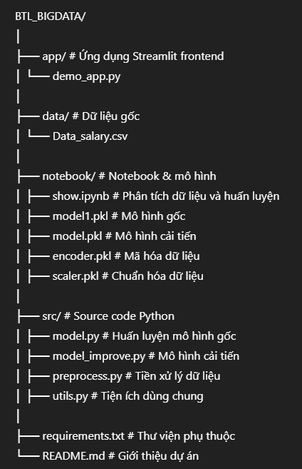

# IT Salary Predict
Dự án dự báo mức lương ngành Công nghệ Thông tin dựa trên các đặc trưng như số năm kinh nghiệm, kỹ năng, loại công việc, mức độ remote,...

## 🚀 Hướng dẫn chạy ứng dụng

### 1. Cài các thư viện cần thiết

```bash
pip install -r requirements.txt
```
### 2. Chạy ứng dụng
Vào show.ipynb bấm 'Run All' để chạy toàn bộ code 

Sau đó để khởi chạy ứng dụng
```bash
streamlit run app/demo_app.py
```
## 📁 Cấu trúc dự án


## 📊 Thông tin ứng dụng
### Mô hình
Mô hình chính: Linear Regression

Cải tiến: thử nghiệm với các biến đầu vào đã chuẩn hóa và mã hóa

Mã hóa đặc trưng: OneHotEncoder, chuẩn hóa: StandardScaler

Hiệu suất mô hình đánh giá bằng: R², RMSE

### Dữ liệu
Nguồn: Kaggle — Data Developer Salaries 2024

Các đặc trưng bao gồm:

work_year, experience_level, employment_type

job_title, remote_ratio, company_location

salary_in_usd, ...

### Kết quả
Mô hình có thể dự đoán mức lương tương đối sát so với thực tế.

Streamlit UI giúp người dùng dễ dàng nhập thông tin và xem kết quả dự đoán.

### 🛠 Công nghệ sử dụng
Ngôn ngữ: Python

Thư viện
- pandas, numpy

- scikit-learn

Framework: Streamlit